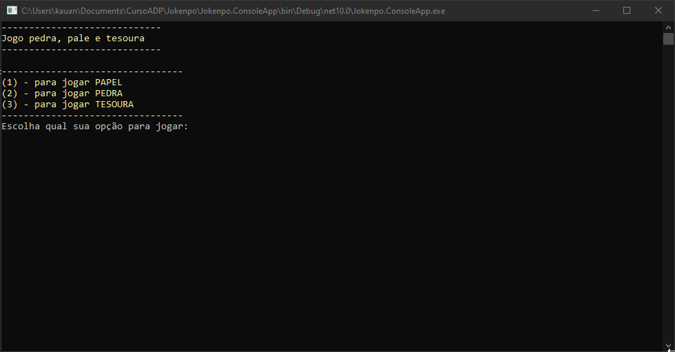

# Jogo Pedra, Papel e Tesoura

## Descrição

Este projeto consiste em um jogo digital de Pedra, Papel e Tesoura desenvolvido em **C# utilizando aplicação de console.**
O jogador humano compete contra o computador, que realiza jogadas de forma aleatória.

O objetivo do jogo é vencer as rodadas seguindo as regras clássicas:

- Pedra vence Tesoura
- Tesoura vence Papel
- Papel vence Pedra

## Objetivo do Projeto

Este projeto foi desenvolvido como exercício de lógica de programação no curso Academia do Programador, com o objetivo de praticar:

- Entrada e saída de dados no console
- Estruturas de decisão (if, switch)
- Estruturas de repetição (while, for)
- Geração de números aleatórios
- Organização de código em métodos

## Funcionalidades (MVP)
### Iniciar o jogo

O sistema permite iniciar uma nova partida onde o jogador pode escolher entre:

- Pedra
- Papel
- Tesoura

### Jogada do computador

O computador gera automaticamente uma jogada aleatória.

### Determinar vencedor

O sistema compara as escolhas e determina o resultado da rodada:

- Empate (jogadas iguais)
- Vitória do jogador
- Vitória do computador

### Exibir resultado

Ao final de cada rodada, o sistema exibe:

- Jogada do jogador
- Jogada do computador
- Resultado da rodada

### Múltiplas rodadas

O jogador pode continuar jogando várias rodadas sem precisar reiniciar o programa.

### Tecnologias utilizadas
- C#
- .NET
- Console Application